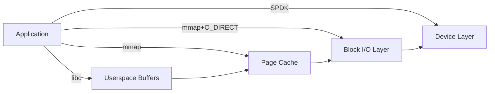
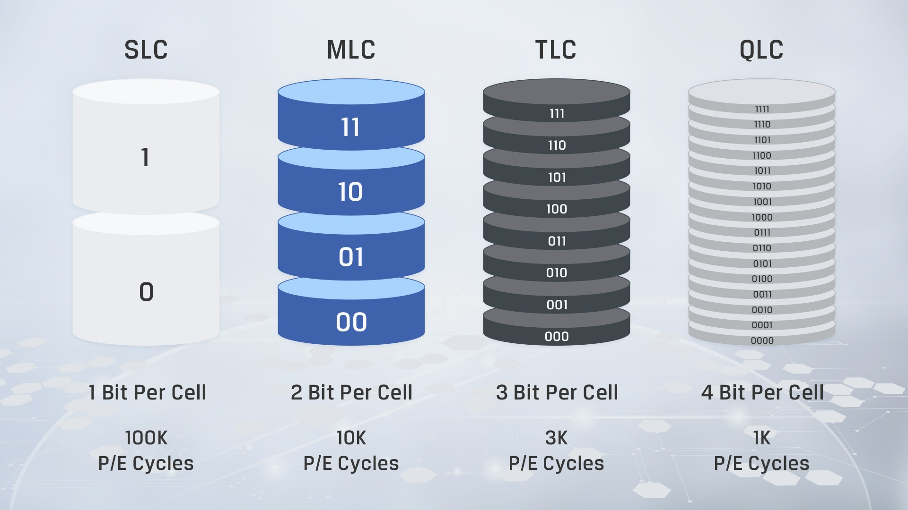
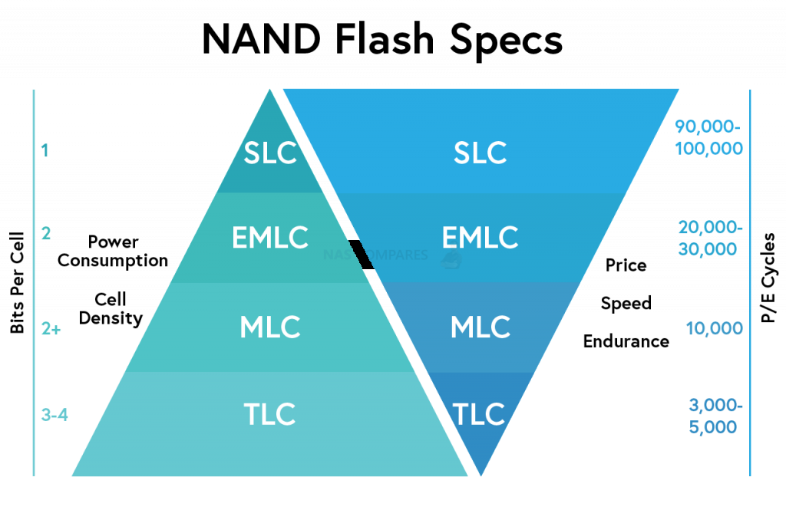

<h1 align="center">Unbranded Cloud Serving Benchmark</h1>
<h3 align="center">
Yahoo Cloud Serving Benchmark for NoSQL Databases<br/>
Refactored and Extended with Batch and Range Queries<br/>
</h3>
<br/>

<p align="center">
<a href="https://discord.gg/AxsU9mctAn"></a>
&nbsp;&nbsp;&nbsp;
<a href="https://www.linkedin.com/company/unum-cloud/"></a>
&nbsp;&nbsp;&nbsp;
<a href="https://twitter.com/unum_cloud"></a>
&nbsp;&nbsp;&nbsp;
<a href="https://unum.cloud/post"></a>
&nbsp;&nbsp;&nbsp;
<a href="https://github.com/unum-cloud/ucset"></a>
</p>

---

Unum Cloud Serving Benchmark is the grandchild of Yahoo Cloud Serving Benchmark, reimplemented in C++, with fewer mutexes or other bottlenecks, and with additional "batch" and "range" workloads, crafted specifically for the Big Data age!

|                         | Present in YCSB | Present in UCSB |
| :---------------------- | :-------------: | :-------------: |
| Size of the dataset     |        ✅        |        ✅        |
| DB configuration files  |        ✅        |        ✅        |
| Workload specifications |        ✅        |        ✅        |
| Tracking hardware usage |        ❌        |        ✅        |
| Workload Isolation      |        ❌        |        ✅        |
| Concurrency             |        ❌        |        ✅        |
| Batch Operations        |        ❌        |        ✅        |
| Bulk Operations         |        ❌        |        ✅        |
| Support of Transactions |        ❌        |        ✅        |

As you may know, benchmarking databases is very complex.
There is too much control flow to tune, so instead of learning the names of a thousand CLI arguments, you'd use a [`run.py`](https://github.com/unum-cloud/UCSB/blob/main/run.py) script to launch the benchmarks.
The outputs will be placed in the `bench/results/` folder.

```sh
git clone https://github.com/unum-cloud/ucsb.git && cd ucsb && ./run.py
```

## Supported Databases

Key-Value Stores and NoSQL databases differ in supported operations.
Including the ones queried by UCSB, like "batch" operations.
When batches aren't natively supported, we simulate them with multiple single-entry operations.

|                        | Bulk Scan | Batch Read | Batch Write | Integer Keys |
| :--------------------- | :-------: | :--------: | :---------: | :----------: |
|                        |           |            |             |              |
| 💾 Embedded Databases   |           |            |             |              |
| WiredTiger             |     ✅     |     ❌      |      ❌      |      ✅       |
| LevelDB                |     ✅     |     ❌      |      ✅      |      ❌       |
| RocksDB                |     ✅     |     ✅      |      ✅      |      ❓       |
| LMDB                   |     ✅     |     ❌      |      ❌      |      ❌       |
| UDisk                  |     ✅     |     ✅      |      ✅      |      ✅       |
|                        |           |            |             |              |
| 🖥️ Standalone Databases |           |            |             |              |
| Redis                  |     ❌     |     ✅      |      ✅      |      ❌       |
| MongoDB                |     ✅     |     ✅      |      ✅      |      ✅       |

There is also asymmetry elsewhere:

* WiredTiger supports fixed-size integer keys.
* LevelDB only supports variable length keys and values.
* RocksDB has minimal support for [`fixed_key_len`](https://cs.github.com/facebook/rocksdb?q=fixed_key_len), incompatible with `BlockBasedTable`.
* UDisk supports both fixed-size keys and values.

Just like YCSB, we use 8-byte integer keys and 1000-byte values.
Both WiredTiger and UDisk were configured to use integer keys natively.
RocksDB wrapper reverts the order of bytes in keys to use the native comparator.
None of the DBs was set to use fixed-size values, as only UDisk supports that.

---

Recent results:

* 1 TB collections. Mar 22, 2022. [post](https://unum.cloud/post/2022-03-22-ucsb)
* 10 TB collections. Sep 13, 2022. [post](https://unum.cloud/post/2022-09-13-ucsb-10tb/)

---

- [Supported Databases](#supported-databases)
- [Yet Another Benchmark?](#yet-another-benchmark)
- [Preset Workloads](#preset-workloads)
- [Ways to Spoil a DBMS Benchmark](#ways-to-spoil-a-dbms-benchmark)
  - [Durability vs Write Speed](#durability-vs-write-speed)
  - [Strict vs Flexible RAM Limits](#strict-vs-flexible-ram-limits)
  - [Dataset Size and NAND Modes](#dataset-size-and-nand-modes)
  - [Slow Benchmarks for Fast Code](#slow-benchmarks-for-fast-code)
  - [Incomplete Measurements](#incomplete-measurements)

---

## Yet Another Benchmark?

Yes.
In the DBMS world there are just 2 major benchmarks:

* [YCSB](https://github.com/brianfrankcooper/YCSB) for NoSQL.
* [TPC](https://www.tpc.org/) for SQL.

With YCSB everything seems simple - clone the repo, pick a DBMS, run the benchmark.
TPC suite seems more "enterprisey", and after a few years in the industry, I still don't understand the procedure.
Moreover, most SQL databases these days are built on top of other NoSQL solutions, so NoSQL is more foundational.
So naturally we used YCSB internally.

We were getting great numbers.
All was fine until it wasn't.
We looked under the hood and realized that the benchmark code itself was less efficient than the databases it was trying to evaluate, causing additional bottlenecks and affecting the measurements.
So just like others, we decided to port it to C++, refactor it, and share with the world.

## Preset Workloads

* **∅**: imports monotonically increasing keys 🔄
* **A**: 50% reads + 50% updates, all random
* **C**: reads, all random
* **D**: 95% reads + 5% inserts, all random
* **E**: range scan 🔄
* **✗**: batch read 🆕
* **Y**: batch insert 🆕
* **Z**: scans 🆕

The **∅** was previously implemented as one-by-one inserts, but some KVS support the external construction of its internal representation files.
The **E** was [previously](https://github.com/brianfrankcooper/YCSB/blob/master/workloads/workloade) mixed with 5% insertions.

## Ways to Spoil a DBMS Benchmark

> Unlike humans, [ACID](https://en.wikipedia.org/wiki/ACID) is one of the best things that can happen to DBMS 😁

### Durability vs Write Speed

Like all good things, ACID is unreachable, because of at least one property - Durability.
Absolute Durability is practically impossible and high Durability is expensive.

All high-performance DBs are designed as [Log Structured Merge Trees](https://en.wikipedia.org/wiki/Log-structured_merge-tree).
It's a design that essentially bans in-place file overwrites.
Instead, it builds layers of immutable files arranged in a Tree-like order.
The problem is that until you have enough content to populate an entire top-level file, you keep data in RAM - in structures often called `MemTable`s.


If the lights go off, volatile memory will be discarded.
So a copy of every incoming write is generally appended to a Write-Ahead-Log (WAL).
Two problems  here:

1. You can't have a full write confirmation before appending to WAL. It's still a write to disk. A system call. A context switch to kernel space. Want to avoid it with [`io_uring`](https://unixism.net/loti/what_is_io_uring.html) or [`SPDK`](https://spdk.io), then be ready to change all the above logic to work in an async manner, but fast enough not to create a new bottleneck.  Hint: [`std::async`](https://en.cppreference.com/w/cpp/thread/async) will not cut it.
2. WAL is functionally stepping on the toes of a higher-level logic. Every wrapping DBMS, generally implements such mechanisms, so they disable WAL in KVS, to avoid extra stalls and replication. Example: [Yugabyte is a port](https://blog.yugabyte.com/how-we-built-a-high-performance-document-store-on-rocksdb/) of Postgres to RocksDB and disables the embedded WAL.

We generally disable WAL and benchmark the core.
Still, you can tweak all of that in the UCSB configuration files yourself.

Furthermore, as widely discussed, [flushing the data still may not guarantee it's preservation on your SSD](https://twitter.com/xenadu02/status/1495693475584557056?s=20&t=eG2cIbzMg_rTq379EkkHMQ).
So pick you ~~poison~~ hardware wisely and tune your benchmarks cautiously.

### Strict vs Flexible RAM Limits

When users specify a RAM limit for a KVS, they expect all of the required in-memory state to fit into that many bytes.
It would be too obvious for modern software, so here is one more problem.

Fast I/O is hard.
The faster you want it, the more abstractions you will need to replace.



Generally, OS keeps copies of the requested pages in RAM cache.
To avoid it, enable [`O_DIRECT`](https://man7.org/linux/man-pages/man2/open.2.html).
It will slow down the app and would require some more engineering.
For one, all the disk I/O will have to be aligned to page sizes, [generally 4KB](https://docs.pmem.io/persistent-memory/getting-started-guide/creating-development-environments/linux-environments/advanced-topics/i-o-alignment-considerations), which includes both the address in the file and the address in the userspace buffers.
Split-loads should also be managed with an extra code on your side.
So most KVS (except for UDisk, of course 😂) solutions don't bother implementing very fast I/O, like `SPDK`.
In that case, they can't even know how much RAM the underlying OS has reserved for them.
So we have to configure them carefully and, ideally, add external constraints:

```sh
systemd-run --scope -p MemoryLimit=100M /path/ucsb
```

Now a question.
Let's say you want to [`mmap`](https://man7.org/linux/man-pages/man2/mmap.2.html) files and be done.
Anyways, Linux can do a far better job at managing caches than most DBs.
In that case - the memory usage will always be very high but within the limits of that process.
As soon as we near the limit - the OS will drop the old caches.
Is it better to use the least RAM or the most RAM until the limit?

For our cloud-first offering, we will favour the second option.
It will give the users the most value for their money on single-purpose instances.

Furthermore, we allow and enable "**Workload Isolation**" in UCSB by default.
It will create a separate process and a separate address space for each workload of each DB.
Between this, we flush the whole system.
The caches filled during insertions benchmarks, will be invalidated before the reads begin.
This will make the numbers more reliable but limits concurrent benchmarks to one.

### Dataset Size and NAND Modes

Large capacity SSDs store multiple bits per cell.
If you are buying a Quad Level Cell SSD, you expect each of them to store 4 bits of relevant information.
That may be a false expectation.



The SSD can switch to SLC mode during intensive writes, where IO is faster, especially if a lot of space is available.
In the case of an 8 TB SSD, before we reach 2 TB used space, all [NAND](https://en.wikipedia.org/wiki/Flash_memory) arrays can, in theory, be populated with just one relevant bit.



If you are benchmarking the DBMS, not the SSD, ensure that you did all benchmarks within the same mode.
In our case for a 1 TB workload on 8 TB drives, it's either:

* starting with an empty drive,
* starting with an 80% full drive.

### Slow Benchmarks for Fast Code

Returning to the topic of deficiencies in the original implementation, let's linger on the fact that is implemented in Java, while all performant Key-Value Stores are implemented in C and C++.
This means, that you would need some form of a “Foreign Function Interface” to interact with the KVS.
This immediately adds unnecessary work for our CPU, but it’s a minor problem compared to rest.

Every language and its ecosystem has different priorities. Java focuses on the simplicity of development, while C++ trades it for higher performance.

```java
private static String getRowKey(String db, String table, String key) {
    return db + ":" + table + ":" + key;
}
```

The above snippet is from the [Apples & SnowFlakes FoundationDB adapter inside YCSB](https://github.com/brianfrankcooper/YCSB/blob/ce3eb9ce51c84ee9e236998cdd2cefaeb96798a8/foundationdb/src/main/java/site/ycsb/db/foundationdb/FoundationDBClient.java#L100), but it’s identical across the entire repo.
It’s responsible for generating keys for queries, so it runs on the hot path.
Here is what a modern recommended C++ version would look like:

```cpp
auto get_row_key(std::string_view db, std::string_view table, std::string_view key) {
    return std::format("{}:{}:{}", db, table, key);
}
```

From Java 7 onwards, the [Java String Pool](https://www.baeldung.com/java-string-pool) lives in the Heap space, which is garbage collected by the JVM.
This code will produce a `StringBuilder`, a heap-allocated array of pointers to heap-allocated strings, later materializing in the final concatenated `String`.
Of course, on-heap again.
And if we know something about High-Performance Computing, the heap is expensive, but together with Garbage Collection and multithreading, it becomes completely intolerable.
The same applies to the C++ version.
Yes, we are doing only 1 allocation there, but it is also too slow to be called HPC.
We need to replace `std::format` with `std::format_to` and export the result into a reusable buffer.

---

If one example is not enough, below is the [code snippet](https://github.com/brianfrankcooper/YCSB/blob/ce3eb9ce51c84ee9e236998cdd2cefaeb96798a8/core/src/main/java/site/ycsb/generator/ZipfianGenerator.java#L250), which produces random integers before packing them into `String` key.

```java
long nextLong(long itemcount) {
    // from "Quickly Generating Billion-Record Synthetic Databases", Jim Gray et al, SIGMOD 1994
    if (itemcount != countforzeta) {
        synchronized (this) {
            if (itemcount > countforzeta) {
                ...
            else
                ...
        }
    }

    double u = ThreadLocalRandom.current().nextDouble();
    double uz = u * zetan;
    if (uz < 1.0)
        return base;
    if (uz < 1.0 + Math.pow(0.5, theta))
        return base + 1;

    long ret = base + (long) ((itemcount) * Math.pow(eta * u - eta + 1, alpha));
    setLastValue(ret);
    return ret;
}
```

To generate a `long`, YCSB is doing numerous operations on `double`-s, by far the most computationally expensive numeric type on modern computers (except for integer division).
Aside from that, this Pseudo-Random Generator contains 4x if statements and `synchronized (this)` mutex.
Creating random integers for most distributions is generally within 50 CPU cycles or 10 nanoseconds.
In this implementation, every if branch may cost that much, and the mutex may cost orders of magnitude more.
If you are writing a benchmark, don't do that.

### Incomplete Measurements

If you use Google Benchmark, you know about its [bunch of nifty tricks](/post/2022-03-04-gbench), like `DoNotOptimize` or the automatic resolution of the number of iterations at runtime.
It's widespread in micro-benchmarking, but it begs for extensions when you start profiling a DBMS.
The ones shipped with UCSB spawn a sibling process that samples usage statistics from the OS.
Like `valgrind`, we read from `/proc/*` [files](https://man7.org/linux/man-pages/man5/proc.5.html) and aggregate stats like SSD I/O and overall RAM usage.
Those are better than nothing, but they are far less accurate, than what can be accomplished with eBPF.
We have a pending ticket for its implementation.
Don't wait, contribute 🤗
