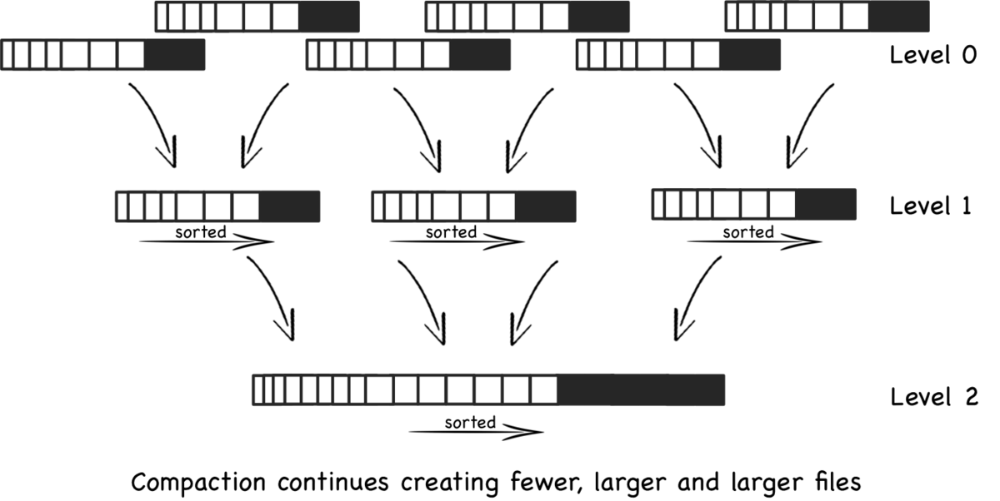
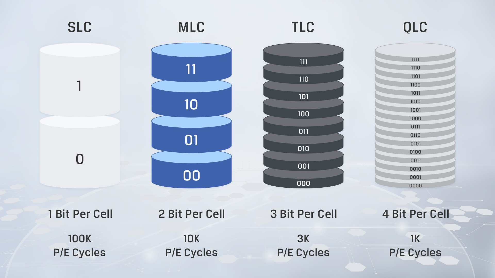
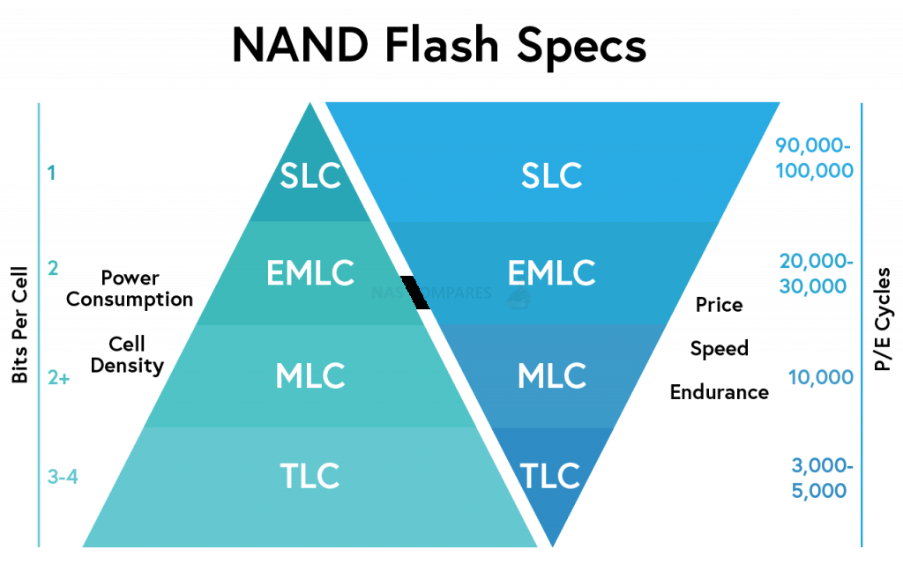

# CrudEval

__CrudEval__ benchmarks Create, Read, Update, and Delete paths at crude hardware speeds.
It is the Rust successor to UCSB and a sibling of [RetriEval](https://github.com/ashvardanian/RetriEval).
One shared runner drives embedded storage engines and database servers, with opt-in document and graph workloads.
Runs use seeded data, verify returned values, and write latency distributions, throughput, resource usage, and configuration to JSON.

## Build and run

Rust 1.95 or newer is required.
Ubuntu 26.04 is the primary Linux target; embedded backends also build on macOS.
The packaged compiler may be older than the current dependencies require, so install the toolchain with rustup.

```sh
sudo apt-get install build-essential clang libclang-dev cmake pkg-config
cargo run --release --bin crud-eval-sqlite -- \
    --records 100K --threads 4 --output results/

cargo run --release --no-default-features --features rocksdb-backend \
    --bin crud-eval-rocksdb -- --records 100K,1M --threads 1,4
```

SQLite is the default Cargo feature.
Every other binary has its own `<engine>-backend` feature; engine code is compiled only when selected.
Server binaries require a running Docker daemon and pull a pinned image on first use.
They publish a random port on localhost, wait for a successful database request, and remove their own containers when the run ends.
Database files remain in the run's data directory.

```sh
cargo run --release --no-default-features --features redis-backend \
    --bin crud-eval-redis -- --records 100K --threads 4
cargo run --release --no-default-features --features mongodb-backend \
    --bin crud-eval-mongodb -- --data-model documents --durability buffered \
    --records 10K --workloads bulk-load,read-95-update-5,read
cargo run --release --no-default-features --features postgres-backend \
    --bin crud-eval-postgres -- --data-model graph --records 1K --degree 8
cargo run --release --no-default-features --features neo4j-backend \
    --bin crud-eval-neo4j -- --data-model graph --durability flushed --records 1K
```

## Backends

| Before: UCSB | Now: CrudEval | Key-value | Documents | Graphs |
| :-- | :-- | :--: | :--: | :--: |
| RocksDB | `crud-eval-rocksdb`, RocksDB 11.8.1 | ✓ | | |
| LMDB | `crud-eval-lmdb`, through `heed` | ✓ | | |
| LevelDB | Deferred to UStore v1's LevelDB engine | | | |
| WiredTiger | Covered through MongoDB; no native submodule | | | |
| UStore's old C API | Deferred until UStore v1 has a public Rust dependency | | | |
| Redis | `crud-eval-redis`, Redis, Valkey, Dragonfly, Garnet, or Kvrocks | ✓ | | |
| MongoDB | `crud-eval-mongodb`, MongoDB or FerretDB | ✓ | ✓ | |
| — | `crud-eval-redb` | ✓ | | |
| — | `crud-eval-fjall` | ✓ | | |
| — | `crud-eval-sqlite` | ✓ | ✓ | |
| — | `crud-eval-postgres` | ✓ | ✓ | ✓ |
| — | `crud-eval-neo4j`, Neo4j or Memgraph | | | ✓ |
| — | `crud-eval-falkordb` | | | ✓ |

Run each binary with `--help` for its engine-specific settings.
Reports include the effective durability settings and whether batch and bulk operations are native.
Redis has no ordered range operation; range reads and full scans are reported as skipped.
A data model unsupported by the selected binary is rejected explicitly.

## Workloads

Names spell out the operation and mix; there are no single-letter workload codes.
`--distribution uniform|zipf|latest` overrides sampling; an explicitly named latest-read workload requires the latest distribution.
A run executes the comma-separated chain in order, preserving data between phases.
The default chain preserves UCSB's nine phases:

```text
bulk-load,read,batch-read-256,range-read-256,full-scan,read-50-update-50,read-latest-95-insert-5,batch-insert-1000,delete-oldest
```

| UCSB / YCSB | Workload | Meaning |
| :-- | :-- | :-- |
| Init | `bulk-load` | Load fresh ascending keys in batches of 100,000 |
| Read / C | `read` | Read one existing key |
| BatchRead | `batch-read-256` | Read 256 distinct keys per call |
| RangeSelect | `range-read-256` | Inclusive ordered range, at most 256 entries |
| Scan | `full-scan` | Page through disjoint contiguous shards |
| ReadUpdate / A | `read-50-update-50` | Half reads, half updates |
| B | `read-95-update-5` | Read-mostly mix |
| ReadUpsert / D | `read-latest-95-insert-5` | Read recent keys and insert fresh keys |
| E | `range-read-95-insert-5` | Short ranges of 1–100 entries, with inserts |
| F | `read-50-read-modify-write-50` | Read, then modify the returned record |
| BatchUpsert | `batch-insert-1000` | Insert 1,000 fresh keys per call |
| Remove | `delete-oldest` | Delete the oldest live keys once each |

The numeric suffixes on batch, range, and bulk-load names are configurable: `batch-read-64`, `range-read-1K`, or `bulk-load-10K`.
Mix percentages are per call; throughput is successful entries per second.
`--entries 10%` sets each ordinary phase's attempted entry budget relative to the initial record count.
A final partial batch uses the remaining budget.
Bulk load always loads `--records`; full scan covers the current live keyspace.
`--duration 30s` replaces the ordinary phases' entry budget with a time limit.

```sh
cargo run --release --bin crud-eval-sqlite -- \
    --records 100K --threads 4 --entries 20K --value-size 100B..1KiB \
    --workloads bulk-load,read-95-update-5,read-50-read-modify-write-50 \
    --transaction-size 32 --durability flushed
```

`--rate` specifies aggregate scheduled calls per second across workers.
Rate-controlled latency starts at the intended arrival time, including queueing when workers fall behind.
Without a rate, latency measures the adapter call only.
End-to-end throughput includes workload generation and verification; `--no-verify` disables value verification for measuring that cost separately.
Transactions commit within the measured phase, every `--transaction-size` calls, including a final partial group.
Backends without grouped transactions reject that option.

## Data models

| Operation | Key-value | Documents | Graphs |
| :-- | :-- | :-- | :-- |
| Insert / load | UUID and binary value | JSON document | Vertex and outgoing edges |
| Read | Complete value | Complete document | Vertex version and outgoing adjacency |
| Update | Replace existing value | Set `/score` using the database's JSON/document operation | Rewire the first outgoing edge |
| Delete | Remove key | Remove document | Remove vertex and incident edges |
| Range read | Ordered keys | Ordered documents | Distinct two-hop outgoing neighbors, capped by range length |
| Full scan | Ordered keyspace | Ordered document collection | Ordered vertex scan with adjacency |

### UUID representation and ordering

`Key` is `uuid::Uuid`, constructed as `Uuid::from_u128(n as u128)` from a sequential `u64` counter starting at zero.
Its logical width is 16 bytes: the integer is zero-extended to 128 bits and encoded big-endian.
For example, key 1 renders as `00000000-0000-0000-0000-000000000001`, and key 256 as `00000000-0000-0000-0000-000000000100`.
The constructor preserves those bits; it does not set UUID version or variant bits.
These are deterministic benchmark identifiers, not generated UUIDv4 or UUIDv7 values, and independent datasets intentionally reuse them.

| Adapter | Indexed key representation |
| :-- | :-- |
| RocksDB, LMDB, redb, fjall, SQLite, Redis family | Raw 16-byte keys; SQLite uses a BLOB |
| PostgreSQL | 16-byte `bytea`, rather than PostgreSQL's native `uuid` type |
| MongoDB and FerretDB | 16-byte BSON Binary `_id` with the generic subtype, rather than the UUID subtype |
| Neo4j, Memgraph, FalkorDB | Canonical 36-character UUID strings in the vertex `id` property |

Binary keys and canonical strings preserve the same integer ordering; Redis-family adapters do not expose ordered ranges.
Documents and graph payloads also render identifiers as canonical strings where their JSON representation requires them.
The logical 16-byte width does not imply equal physical index size or serialization cost across engines.
Sequential insertion favors ordered-key locality; this workload does not measure random-UUID insertion behavior.
This deliberately changes UCSB's eight-byte key format, so the historical results are not a like-for-like key-size comparison.

One shared keyspace allocates disjoint insert ranges and exposes only a contiguous prefix of completed commits to readers.
Each thread has a seeded generator; concurrency still makes mixed-workload interleavings nondeterministic.
Zipfian sampling retains UCSB's θ=0.99, fixed large domain, and FNV scramble using double precision.

Binary values have a 24-byte UUID/version header and a deterministic body drawn from a 64 MiB pool built before measurement.
Reads verify the requested key, encoded length, and every body byte.
Documents contain `_id`, mutable integer `score`, and an immutable hex payload derived from the binary value.
Consequently `--value-size` describes the binary payload, not the larger serialized document size; reports count actual processed bytes.
Document updates currently target `/score` only.
Graph vertices carry a version and stable edge slots; their targets follow a seeded skewed distribution over the initial population.
`--degree` is capped at the initial population minus one, with self-loops and duplicate targets excluded.
Adjacency reads are checked against the deterministic graph model, accounting for deleted vertices.
Two-hop results are checked for valid keys, duplicates, and the requested bound; the verifier does not independently replay a concurrent graph traversal.

## Configuration and reports

| Old interface | New interface |
| :-- | :-- |
| `ucsb_bench -db rocksdb` | `crud-eval-rocksdb` |
| CMake engine switches | Cargo `<engine>-backend` features |
| `run.py -sz 100MB,1GB -th 1,8` | `--records 100K,1M --threads 1,8` |
| Workload JSON files | `--workloads` and explicit workload names |
| Engine `.cfg` files | Typed engine-specific CLI options |
| `operations_count` | `--entries` or `--duration` |
| `value_length` | `--value-size` |
| `run.py -dp` | `--drop-caches`, Linux only |
| Nested merged Google Benchmark files | One `<backend>-<config-hash>.json` per configuration |

`--data-dir` defaults to `data/` and `--output` to `results/`.
A chain beginning with bulk load replaces only its own marked benchmark directory.
Unmarked existing directories are never cleared.
A chain without bulk load reuses that configuration's data and restores the live key range saved after its last successful phase.
Interrupted or failed mutations leave the dataset marked dirty; reload it before another run.
Do not run two copies of the same configuration against the same data directory concurrently.
The server adapters currently reject `--reopen` and `--drop-caches`; embedded adapters close and reopen between phases when requested.
Dropping the page cache requires Linux permissions and affects the whole host.
It does not provide a separate process or machine for each phase.

Reports are rewritten atomically after each phase.
They contain the machine, requested configuration, engine metadata, capabilities, completed/skipped/failed phases, successful entries, missing entries, errors, processed bytes, and disk size.
Latency is recorded in nanoseconds with p50, p90, p99, p99.9, and maximum per operation.
The timeline counts completed entries in each second of the phase.
Flush/checkpoint time is reported separately from workload time.
CPU, RSS, virtual memory, and process I/O are sampled every 100 ms; very short phases have limited sampling resolution.
Server reports additionally include a Docker resource snapshot after the phase, explicitly separate from client process measurements.
These snapshots are not interval-average server measurements.
Optional `--perf-counters` requires a Linux build with the `perf-counters` feature and kernel permission to open hardware counters.
Counters cover worker threads, excluding background engine threads and server processes.
Missing results, failed operations, and corrupted values are distinct; execution errors produce a nonzero exit status and preserve the partial report.

```sh
uv run scripts/plot.py results/
```

The plotting script reads the JSON reports and writes throughput, latency, memory, and disk figures.

## Project structure

```text
Cargo.toml                 Feature-gated backend binaries
src/bench.rs               Library root, CLI, sweeps, worker loop
src/backend.rs             Backend and per-worker session contracts
src/workload.rs            Explicit workload names and size parsing
src/data.rs                Seeded sampling, keyspace, binary values
src/model.rs               Key-value, document, and graph verification
src/measure.rs             Histograms and process resource sampling
src/output.rs              Machine/configuration reports and atomic output
src/perf_counters.rs       Optional Linux worker hardware counters
src/docker.rs              Owned container lifecycle
src/cypher.rs              Shared graph operations for Cypher servers
src/<engine>.rs            One binary per storage adapter
scripts/plot.py            Report visualization
```

Directory guides describe [source contracts](src/README.md), [test coverage](src/README.md#tests), [plotting](scripts/README.md), [standalone server configurations](docker/README.md), and [historical figures](assets/README.md).

## Remaining scope

The implemented backend matrix above describes current support, not the full set of candidates considered during planning.
UStore v1 remains deferred until its Rust dependency is public; its LevelDB engine is consequently absent too.
Native WiredTiger was deliberately excluded to avoid a separate C build and submodule; MongoDB exercises WiredTiger through a different interface and is not a substitute for a direct engine benchmark.
ScyllaDB, Cassandra, FoundationDB, Aerospike, SurrealDB, SplinterDB, and Haura remain later candidates, with no adapters or placeholder binaries in this crate.

The following planned capabilities remain incomplete:

- Grouped transactions beyond LMDB, redb, SQLite, and PostgreSQL.
- Docker reopen/cache-drop support and continuous server resource sampling; current server statistics are post-phase snapshots.
- Document field updates beyond `/score`, incoming-neighbor graph reads, and an independent exact verifier for two-hop traversals.
- Multiple storage directories; the old multi-disk configuration has no replacement yet.
- Automated live-server integration tests and CI; current server validation was run manually against the pinned containers.

## Ways to spoil a DBMS benchmark

### Durability versus write speed

Acknowledging a write in memory differs from acknowledging it after a durable log flush.
`--durability none`, `buffered`, and `flushed` make the requested policy explicit; metadata records the engine's actual settings.
Some engines cannot disable logging, and stronger behavior must not be presented as equivalent to a log-free write.
MongoDB requires `buffered` or `flushed`; Neo4j and Memgraph require `flushed`.
Device firmware and power-loss protection also affect what a successful flush guarantees.

LSM engines buffer writes and merge sorted files in the background.



Compaction can outlast the foreground workload.
RocksDB's bulk-load flush includes compaction, outside the measured load phase.
Keep that separate time when comparing ingestion costs.

### Engine caches and operating-system caches

An engine's configured cache limit is not a process or machine memory limit.
Memory-mapped pages, the filesystem cache, client buffers, and database server memory all matter.
Measure the server as well as the client, and use operating-system limits when the experiment calls for a fixed memory budget.
A warm-cache read and a cold-cache read answer different questions.
Report the cache policy and working set rather than assuming one run establishes both.

### Dataset size and NAND modes

An SSD's write performance can change after its SLC cache fills and as available capacity falls.





Compare engines on similarly prepared drives, with enough data and runtime to reach the intended operating regime.
Small datasets can benchmark the device's cache rather than its sustained storage behavior.

### Harness overhead and incomplete measurements

Allocations, synchronization, key generation, value generation, and verification can bottleneck an otherwise fast engine.
CrudEval keeps generated values outside the engine-call latency interval and uses worker-local histograms.
Throughput still includes the harness cost, so inspect both metrics.
A batch's latency is the latency of the whole batch, not a fabricated per-key percentile.
A read-modify-write without a transaction is two calls and does not promise isolation against concurrent updates.
Resource samples are approximate, and a Docker snapshot does not replace continuous server profiling.

## History

UCSB expanded the Yahoo Cloud Serving Benchmark with batch and range operations and described itself as the “Unbranded Cloud Serving Benchmark,” a grandchild of YCSB implemented in C++.
The original work was introduced in [Unbranding and Extending the Yahoo Cloud Serving Benchmark](https://www.unum.cloud/blog/2022-03-22-ucsb) on March 22, 2022, followed by [Beating RocksDB by up to 7x in almost every workload](https://www.unum.cloud/blog/2022-09-13-ucsb-10tb) on September 13, 2022.
Those historical results are not measurements of this Rust implementation.
The old single-precision Zipfian generator also restricted the effective sampled keyspace; the cleanup corrected it before this rewrite.
CrudEval preserves the workload lineage while changing key width, verification, key allocation, transaction timing, and reporting.
