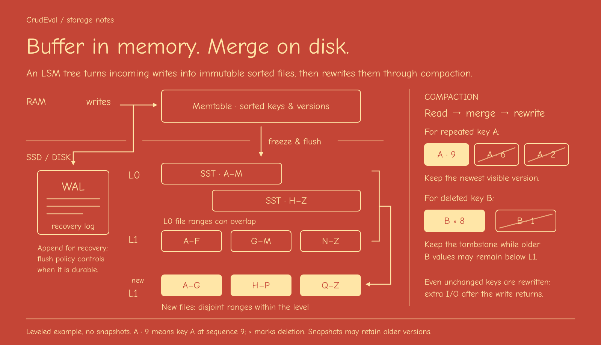
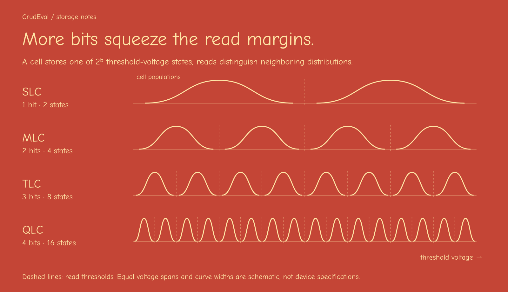
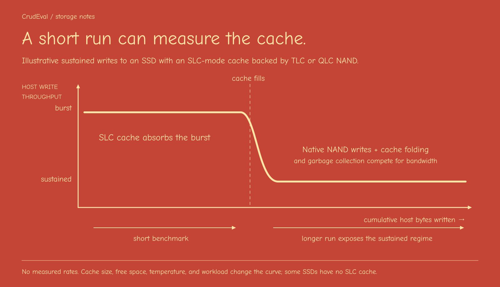

# CrudEval

__CrudEval__ benchmarks Create, Read, Update, and Delete paths at crude hardware speeds.
It is the Rust successor to UCSB and a sibling of [RetriEval](https://github.com/ashvardanian/RetriEval).
One shared runner drives embedded storage engines and database servers, with opt-in document and graph workloads.
Runs use seeded data, verify returned values, and write latency distributions, throughput, resource usage, and configuration to JSON.

## Build and run

```sh
sudo apt-get install build-essential clang libclang-dev cmake pkg-config
cargo run --release --bin crud-eval-sqlite -- \
    --records 100K --threads 4 --output results/

cargo run --release --no-default-features --features rocksdb-backend \
    --bin crud-eval-rocksdb -- --records 100K,1M --threads 1,4
```

SQLite is the default Cargo feature.
Every other binary has its own `<engine>-backend` feature; engine code is compiled only when selected.
Server binaries require a running Docker daemon and pull a pinned image on first use.
They publish a random port on localhost, or the `--port` a binary takes, wait for a successful database request, and remove their own containers when the run ends.
Database files remain in the run's data directory.

```sh
cargo run --release --no-default-features --features redis-backend \
    --bin crud-eval-redis -- --records 100K --threads 4
cargo run --release --no-default-features --features mongodb-backend \
    --bin crud-eval-mongodb -- --data-model documents --durability buffered \
    --records 10K --workloads bulk-load,read-95-update-5,read
cargo run --release --no-default-features --features postgres-backend \
    --bin crud-eval-postgres -- --data-model graph --records 1K --degree 8
cargo run --release --no-default-features --features neo4j-backend \
    --bin crud-eval-neo4j -- --data-model graph --durability flushed --records 1K
```

## Backends

| Backend                                                         | Key-value | Documents | Graphs |
| :-------------------------------------------------------------- | :-------: | :-------: | :----: |
| `crud-eval-rocksdb`, RocksDB 11.8.1                             |     ✓     |           |        |
| `crud-eval-lmdb`, through `heed`                                |     ✓     |           |        |
| `crud-eval-redis`, Redis, Valkey, Dragonfly, Garnet, or Kvrocks |     ✓     |     ✓     |        |
| `crud-eval-mongodb`, MongoDB or FerretDB                        |     ✓     |     ✓     |        |
| `crud-eval-redb`                                                |     ✓     |           |        |
| `crud-eval-fjall`                                               |     ✓     |           |        |
| `crud-eval-sqlite`                                              |     ✓     |     ✓     |        |
| `crud-eval-postgres`                                            |     ✓     |     ✓     |   ✓    |
| `crud-eval-neo4j`, Neo4j or Memgraph                            |           |           |   ✓    |
| `crud-eval-falkordb`                                            |           |           |   ✓    |
| `crud-eval-turso`, embedded Turso 0.8.1                         |     ✓     |     ✓     |        |
| `crud-eval-surrealdb`, SurrealDB 3.3.0                          |           |     ✓     |   ✓    |
| `crud-eval-scylladb`, ScyllaDB 2026.3.2                         |     ✓     |     ✓     |        |

Every binary's settings, engine-specific ones included, are listed under "Settings" below.
Reports include effective durability and distinguish native batches, protocol pipelines, and per-record loops for each operation.
Redis and ScyllaDB have no ordered range operation; range reads and full scans are reported as skipped.
A data model unsupported by the selected binary is rejected explicitly.
The matrix describes adapter coverage, not every upstream engine capability.
Redis-family documents use native JSON commands; Valkey needs its JSON bundle, and Garnet needs its JSON module.
FalkorDB supplies native graph operations over the Redis protocol; ordinary Redis-family adapters do not emulate graphs with hashes or sets.
Turso uses the embedded Rust engine, not libSQL or the hosted service; buffered durability is unsupported by this pinned adapter.
Its tables use a UUID index over an ordinary rowid table because the pinned engine's experimental `WITHOUT ROWID` support cannot execute the full mutation workload.
Neo4j checks internal vertex revisions around adjacency reads, with up to eight measured attempts; metadata records the extra round trips and revision storage.
SurrealDB splits large native insert batches to fit its RPC request limit and reports the transaction boundaries between chunks.
ScyllaDB runs one prepared CQL statement per record at `LOCAL_QUORUM` on a single replica, keeping up to 256 in flight per worker instead of sending multi-partition `BATCH` statements.
Its updates and deletes read the key first, so they never create or count a missing record; the check and the write are not atomic.
Documents are typed `score bigint` and `payload text` columns, and updates set the `score` column.
Durability `none` disables the keyspace's `durable_writes`, `buffered` uses periodic commit log sync, and `flushed` uses batch sync.
ScyllaDB needs direct I/O on its data directory, which Docker Desktop's file sharing on macOS does not provide; run it on Linux.

## Workloads

Names spell out the operation and mix; there are no single-letter workload codes.
Sampling defaults to Zipfian; `--distribution uniform|zipf|latest` overrides it.
An explicitly named latest-read workload requires the latest distribution.
A run executes the comma-separated chain in order, preserving data between phases.
The default chain preserves UCSB's nine phases:

```text
bulk-load,read,batch-read-256,range-read-256,full-scan,read-50-update-50,read-latest-95-insert-5,batch-insert-1000,delete-oldest
```

| UCSB / YCSB    | Workload                       | Meaning                                                |
| :------------- | :----------------------------- | :----------------------------------------------------- |
| Init           | `bulk-load`                    | Load fresh sequential keys in batches of up to 100,000 |
| Read / C       | `read`                         | Read one existing key                                  |
| BatchRead      | `batch-read-256`               | Read up to 256 distinct keys per call                  |
| RangeSelect    | `range-read-256`               | Inclusive ordered range, at most 256 entries           |
| Scan           | `full-scan`                    | Page through disjoint contiguous shards                |
| ReadUpdate / A | `read-50-update-50`            | Half reads, half updates                               |
| B              | `read-95-update-5`             | Read-mostly mix                                        |
| ReadUpsert / D | `read-latest-95-insert-5`      | Read recent keys and insert fresh keys                 |
| E              | `range-read-95-insert-5`       | Short ranges of 1–100 entries, with inserts            |
| F              | `read-50-read-modify-write-50` | Read, then modify the returned record                  |
| BatchUpsert    | `batch-insert-1000`            | Insert 1,000 fresh keys per call                       |
| Remove         | `delete-oldest`                | Delete oldest live keys up to the phase budget         |

The numeric suffixes on batch, range, and bulk-load names are configurable: `batch-read-64`, `range-read-1K`, or `bulk-load-10K`.
Mix percentages are per logical operation; throughput is successful entries per second.
Bulk-load keys ascend within each batch; concurrent workers may submit batches out of order.
`--entries 10%` sets each ordinary phase's attempted entry budget relative to the initial record count.
A final partial batch uses the remaining budget.
Bulk load always loads `--records`; full scan covers the current live keyspace.
`--time-limit 30s` replaces the ordinary phases' entry budget with a time limit, in whole `ms` or `s`.
The limit stops new work; in-flight operations and the final transaction commit may finish afterward.

```sh
cargo run --release --bin crud-eval-sqlite -- \
    --records 100K --threads 4 --entries 20K --value-size 100..1KB \
    --workloads bulk-load,read-95-update-5,read-50-read-modify-write-50 \
    --calls-per-transaction 32 --durability flushed
```

`--calls-per-second` sets aggregate scheduled logical operations per second across workers, with one operation in flight per worker.
It sets an arrival schedule, not a guaranteed achieved rate or an entry rate.
Rate-controlled latency starts at the intended arrival time, including preparation and queueing when workers fall behind.
Without a rate, latency measures adapter calls only; read-modify-write sums its read and write call times.
Phase throughput includes workload generation, verification, and transaction boundaries, but excludes setup and the separately reported flush.
`--verify structure` skips value verification, to measure that cost separately.
Transactions commit within the measured phase, every `--calls-per-transaction` logical operations per worker, including a final partial group.
Commit latency has its own histogram.
Backends without grouped transactions reject that option.

## Data models

| Operation     | Key-value              | Documents                                                 | Graphs                                                      |
| :------------ | :--------------------- | :-------------------------------------------------------- | :---------------------------------------------------------- |
| Insert / load | UUID and binary value  | JSON document                                             | Vertex and outgoing edges                                   |
| Read          | Complete value         | Complete document                                         | Vertex version and outgoing adjacency                       |
| Update        | Replace existing value | Set `/score` using the database's JSON/document operation | Rewire the first outgoing edge                              |
| Delete        | Remove key             | Remove document                                           | Remove vertex and incident edges                            |
| Range read    | Ordered keys           | Ordered documents                                         | Distinct two-hop outgoing neighbors, capped by range length |
| Full scan     | Ordered keyspace       | Ordered document collection                               | Ordered vertex scan with adjacency                          |

### UUID representation and ordering

`Key` is `uuid::Uuid`, constructed as `Uuid::from_u128(n as u128)` from a sequential `u64` counter starting at zero.
Its logical width is 16 bytes: the integer is zero-extended to 128 bits and encoded big-endian.
For example, key 1 renders as `00000000-0000-0000-0000-000000000001`, and key 256 as `00000000-0000-0000-0000-000000000100`.
The constructor preserves those bits; it does not set UUID version or variant bits.
These are deterministic benchmark identifiers, not generated UUIDv4 or UUIDv7 values, and independent datasets intentionally reuse them.

| Adapter                                                 | Indexed key representation                                                       |
| :------------------------------------------------------ | :------------------------------------------------------------------------------- |
| RocksDB, LMDB, redb, fjall, SQLite, Turso, Redis family | Raw 16-byte keys; SQLite and Turso use a BLOB                                    |
| PostgreSQL                                              | 16-byte `bytea`, rather than PostgreSQL's native `uuid` type                     |
| MongoDB and FerretDB                                    | 16-byte BSON Binary `_id` with the generic subtype, rather than the UUID subtype |
| Neo4j, Memgraph, FalkorDB                               | Canonical 36-character UUID strings in the vertex `id` property                  |
| SurrealDB                                               | Canonical 36-character UUID strings as native record identifiers                 |
| ScyllaDB                                                | 16-byte `blob` partition key, rather than CQL's native `uuid` type               |

Binary keys and canonical strings preserve the same integer ordering; Redis-family and ScyllaDB adapters do not expose ordered ranges.
Documents and graph payloads also render identifiers as canonical strings where their JSON representation requires them.
The logical 16-byte width does not imply equal physical index size or serialization cost across engines.
Sequential insertion favors ordered-key locality; this workload does not measure random-UUID insertion behavior.
This deliberately changes UCSB's eight-byte key format, so the historical results are not a like-for-like key-size comparison.

One shared keyspace allocates disjoint insert ranges and exposes only a contiguous prefix of completed commits to readers.
Each thread has a seeded generator; concurrency still makes mixed-workload interleavings nondeterministic.
Zipfian sampling retains UCSB's θ=0.99, fixed large domain, and FNV scramble using double precision.

Binary values have a 24-byte UUID/version header and a deterministic body drawn from a 64 MB pool built before measurement.
Reads verify the requested key, expected length, and every body byte.
Documents contain `_id`, mutable integer `score`, and an immutable hex payload derived from the binary value.
Generated scores and graph versions stay within the nonnegative signed 64-bit range shared by the engines.
Consequently `--value-size` describes the binary payload, not the larger serialized document size.
Reported processed bytes count logical values or patches, excluding keys, protocol framing, indexes, and physical storage writes.
Document updates currently target `/score` only.
Graph vertices carry a version and stable edge slots; their targets follow a seeded skewed distribution over the initial population.
`--degree` is capped at the initial population minus one, with self-loops and duplicate targets excluded.
Adjacency reads are checked against the deterministic graph model, accounting for deleted vertices.
Two-hop results are checked for duplicates, exclusion of the starting vertex, and the requested bound; the verifier does not independently replay a concurrent graph traversal.
Verification checks content consistency, not a complete concurrent history: a valid stale value can pass, and document reads do not prove that the latest score update was observed.

## Settings

Every binary takes the common flags; the engine flags apply only to the binary named.
Comma-separated values form a sweep where the meaning says so.
Each run prints every setting at the start, as `- Name: value` in the same grammar the flag reads.
A bad value prints `--flag="value" does not parse, expected …` and exits with status 1.

| Flag                      | Default              | Meaning                                                                                                |
| :------------------------ | :------------------- | :----------------------------------------------------------------------------------------------------- |
| `--records`               | `100K`               | Initial record counts, with decimal `K`/`M`/`G`/`T`; a sweep                                           |
| `--threads`               | `1`                  | Worker counts, `0` for all cores; a sweep                                                              |
| `--workloads`             | the nine-phase chain | Ordered workload names, run as one chain                                                               |
| `--distribution`          | per workload         | Key sampling override: `uniform`, `zipf` or `latest`                                                   |
| `--entries`               | `10%`                | Attempted entries per ordinary phase, a count like `20K` or a share of records                         |
| `--time-limit`            | unset                | Time limit per ordinary phase instead of `--entries`, like `30s` or `500ms`                            |
| `--value-size`            | `1KB`                | Binary payload size or range like `100..1KB`, at least 24 bytes                                        |
| `--data-dir`              | `data`               | Parent directory for marked benchmark databases                                                        |
| `--output`                | `results`            | Directory for JSON reports                                                                             |
| `--seed`                  | `42`                 | Seed for data and per-worker generators, or `random`                                                   |
| `--durability`            | `none`               | Requested write durability: `none`, `buffered` or `flushed`                                            |
| `--data-model`            | `key-value`          | `key-value`, `documents` or `graph`                                                                    |
| `--degree`                | `8`                  | Outgoing graph degree, capped at the initial population minus one                                      |
| `--calls-per-transaction` | unset                | Logical operations per transaction; unset leaves boundaries to the adapter                             |
| `--calls-per-second`      | unset                | Aggregate scheduled operations per second across workers                                               |
| `--verify`                | `values`             | `values` checks payloads and structure, `structure` skips payload checks                               |
| `--perf-counters`         | off                  | Record worker hardware counters; Linux and the `perf-counters` feature only                            |
| `--between-workloads`     | `keep`               | `keep`, `reopen`, or `reopen-and-drop-caches` (Linux only), embedded engines only                      |
| `--cache-size`            | `64MB`               | `crud-eval-sqlite`: page cache per session                                                             |
| `--map-size`              | `1TB`                | `crud-eval-lmdb`: largest database the memory map can hold                                             |
| `--write-buffer-size`     | `128MB`              | `crud-eval-rocksdb`: memtable size before a flush                                                      |
| `--server`                | per binary           | `crud-eval-redis`, `-mongodb`, `-neo4j`: which server speaks the protocol                              |
| `--dragonfly-threads`     | automatic            | `crud-eval-redis --server dragonfly`: I/O threads, when the automatic choice exceeds the memory budget |
| `--port`                  | random               | `crud-eval-scylladb`: host port for CQL on localhost                                                   |
| `--startup-time-limit`    | `120s`               | `crud-eval-scylladb`: time limit for container start and readiness                                     |

## Configuration and reports

| Old interface                        | New interface                                        |
| :----------------------------------- | :--------------------------------------------------- |
| `ucsb_bench -db rocksdb`             | `crud-eval-rocksdb`                                  |
| CMake engine switches                | Cargo `<engine>-backend` features                    |
| `run.py -sz 100MB,1GB -th 1,8`       | `--records 100K,1M --threads 1,8`                    |
| Workload JSON files                  | `--workloads` and explicit workload names            |
| Engine `.cfg` files                  | Typed engine-specific CLI options                    |
| `operations_count`                   | `--entries` or `--time-limit`                        |
| `value_length`                       | `--value-size`                                       |
| `run.py -dp`                         | `--between-workloads reopen-and-drop-caches`         |
| Nested merged Google Benchmark files | One `<backend>-<config-hash>.json` per configuration |

A chain beginning with bulk load replaces only its own marked benchmark directory.
Unmarked existing directories are never cleared.
A chain without bulk load reuses that configuration's data and restores the live key range saved after its last successful phase.
Interrupted or failed mutations leave the dataset marked dirty; reload it before another run.
Do not run two copies of the same configuration against the same data directory concurrently.
The server adapters accept only `--between-workloads keep`; embedded adapters close and reopen between phases when requested.
Dropping the page cache requires Linux permissions and affects the whole host.
It does not provide a separate process or machine for each phase.

Reports are rewritten atomically after each phase.
They contain the machine, requested configuration, engine metadata, capabilities, completed/skipped/failed phases, successful entries, missing entries, errors, processed bytes, and disk size.
Latency is recorded in nanoseconds with p50, p90, p99, p99.9, and maximum per operation.
The timeline counts successful entries when published, after commit for grouped transactions.
Flush/checkpoint time is reported separately from workload time.
CPU, RSS, virtual memory, and process I/O are sampled every 100 ms; very short phases have limited sampling resolution.
Server reports additionally include a Docker resource snapshot after the phase, explicitly separate from client process measurements.
These snapshots are not interval-average server measurements.
Optional `--perf-counters` requires a Linux build with the `perf-counters` feature and kernel permission to open hardware counters.
Counters cover worker threads, excluding background engine threads and server processes.
Missing results, failed operations, and corrupted values are distinct; failed measured phases preserve their report and produce a nonzero exit status.
A short range near the end of the keyspace can legitimately contribute missing entries; full scans require complete coverage.

```sh
uv run scripts/plot.py results/
```

The plotting script reads the JSON reports and writes throughput, latency, memory, and disk figures.

## Project structure

```text
Cargo.toml                 Feature-gated backend binaries
src/bench.rs               Library root, CLI, sweeps, worker loop
src/backend.rs             Backend and per-worker session contracts
src/workload.rs            Explicit workload names and size parsing
src/data.rs                Seeded sampling, keyspace, binary values
src/model.rs               Key-value, document, and graph verification
src/measure.rs             Histograms and process resource sampling
src/output.rs              Machine/configuration reports and atomic output
src/perf_counters.rs       Optional Linux worker hardware counters
src/docker.rs              Owned container lifecycle
src/cypher.rs              Shared graph operations for Cypher servers
src/<engine>.rs            One binary per storage adapter
scripts/plot.py            Report visualization
```

Directory guides describe [source contracts](src/README.md), [test coverage](src/README.md#tests), [plotting](scripts/README.md), and [standalone server configurations](docker/README.md).

## API and allocation ownership

The shared runner is the center of the backend design.
Embedded engines and server adapters implement the same lifecycle contract and provide worker-local sessions.
Key-value operations use borrowed flat byte batches.
`DocumentSession` receives typed scores and payloads; `GraphSession` receives UUIDs, versions, and flat edges with stable slots.
Read methods fill bounded caller-owned buffers and preserve positions for missing records.
Document updates pass only score patches, and graph updates pass only a version and slot-zero target.
JSON and BSON are database wire representations, not the shared record interface.

Calls are synchronous batches with one operation in flight per worker.
Async-only clients run behind the adapter boundary; they do not introduce boxed futures or task fan-out into the common API.
RetriEval follows the same ownership principles for vectors and search results, while retaining engine-owned query parallelism.
The projects share conventions, not a cross-repository framework dependency.

Project-owned collections use explicit `System` allocators, and reusable batch owners accept an allocator parameter.
Bounded buffers are reserved before timing and retain capacity across operations.
Database SDKs, serde values, operating-system APIs, and error strings may require their own standard containers; these allocations remain part of measured driver work where applicable.
The pinned compiler does not expose an allocator parameter for `String`; hot formatting uses borrowed strings or byte buffers.
No dependency may silently select the benchmark's global allocator.

RocksDB and fjall rely on fresh insert keys and disjoint delete-only phases instead of an adapter-wide write mutex.
The key reservation lock protects publication of committed keys; an uncommitted reservation must never become visible to readers.
SQLite's coordinator lock covers checkpointing outside timed CRUD operations.

Schema 2 reports record attempted operation latency and successful committed throughput separately.
Plots separate schema versions so their different measurement semantics cannot be silently combined.

Install local checks with `git config core.hooksPath scripts`.
Run `scripts/check.sh` for unit tests and lint checks, and `scripts/check-servers.sh` for managed server integration checks.

## Remaining scope

The implemented backend matrix above describes current support, not the full set of candidates considered during planning.
UStore v1 remains deferred until its Rust dependency is public; its LevelDB engine is consequently absent too.
Native WiredTiger was deliberately excluded to avoid a separate C build and submodule; MongoDB exercises WiredTiger through a different interface and is not a substitute for a direct engine benchmark.
Cassandra, FoundationDB, Aerospike, SplinterDB, and Haura remain later candidates, with no adapters or placeholder binaries in this crate.

The following planned capabilities remain incomplete:

- Grouped transactions beyond LMDB, redb, SQLite, Turso, and PostgreSQL.
- Docker reopen/cache-drop support and continuous server resource sampling; current server statistics are post-phase snapshots.
- Document field updates beyond `/score`, incoming-neighbor graph reads, and an independent exact verifier for concurrent two-hop traversals.
- Multiple storage directories; the old multi-disk configuration has no replacement yet.
- CUDA-equipped cross-project validation requires a suitable runner.

## Ways to spoil a DBMS benchmark

### Durability versus write speed

Acknowledging a write in memory differs from acknowledging it after a durable log flush.
`--durability none`, `buffered`, and `flushed` make the requested policy explicit; metadata records the engine's actual settings.
Some engines cannot disable logging, and stronger behavior must not be presented as equivalent to a log-free write.
MongoDB requires `buffered` or `flushed`; Neo4j and Memgraph require `flushed`.
Device firmware and power-loss protection also affect what a successful flush guarantees.

LSM engines update a sorted memtable in RAM and, when logging is enabled, append to a write-ahead log (WAL) for recovery.
Freezing and flushing a memtable creates an immutable sorted-string-table (SST) file on disk; it does not merge all older versions away.
The WAL's durability policy and the later SST flush are separate concerns.



In leveled compaction, L0 files can cover overlapping key ranges.
Compaction reads selected files and their overlapping inputs from the next level, merges records by key and sequence number, and writes new SST files with disjoint ranges within that level.
The levels are logical file sets, not separate storage devices; the new L1 row shows a later state of the same level.
Once the new files are installed and old readers no longer need the inputs, obsolete files can be reclaimed.
An update can supersede older versions, but snapshots may still need them; a delete marker must remain while an older covered value could otherwise resurface.
The diagram omits active snapshots.
Other policies make different tradeoffs; see the [RocksDB leveled-compaction guide](https://github.com/facebook/rocksdb/wiki/Leveled-Compaction).

Compaction rewrites existing data, increasing host writes relative to application writes, and can outlast the foreground workload.
The [RocksDB tuning guide](https://github.com/facebook/rocksdb/wiki/RocksDB-Tuning-Guide) explains this write amplification and its tradeoffs with read and space amplification.
RocksDB's bulk-load flush includes compaction, outside the measured load phase.
Keep that separate time when comparing ingestion costs.

### Engine caches and operating-system caches

An engine's configured cache limit is not a process or machine memory limit.
Memory-mapped pages, the filesystem cache, client buffers, and database server memory all matter.
Measure the server as well as the client, and use operating-system limits when the experiment calls for a fixed memory budget.
A warm-cache read and a cold-cache read answer different questions.
Report the cache policy and working set rather than assuming one run establishes both.

### Dataset size and NAND modes

An SSD's write performance can change after its SLC cache fills and as available capacity falls.
NAND cells encode bits in threshold-voltage windows; more bits per cell require more distinguishable windows.
The first diagram shows why increasing capacity per cell makes those states harder to distinguish; its distributions are schematic, not measured specifications.



An SLC-mode write cache can temporarily absorb writes faster than the drive sustains once that cache fills.
The next diagram illustrates that transition under continuous writes; cache capacity, free space, temperature, and workload change its shape.



Compare engines on similarly prepared drives, with enough data and runtime to reach the intended operating regime.
Small datasets can benchmark the device's cache rather than its sustained storage behavior.
Cell program/erase endurance is not drive endurance: error correction, spare capacity, and write amplification also affect rated terabytes written.
See [Kioxia's NAND endurance brief](https://americas.kioxia.com/content/dam/kioxia/en-us/business/memory/asset/KIOXIA-SSD-NAND-Endurance-Tech-Brief.pdf) for the distinction.

### Harness overhead and incomplete measurements

Allocations, synchronization, key generation, value generation, and verification can bottleneck an otherwise fast engine.
CrudEval keeps value preparation outside the unthrottled engine-call latency interval and uses worker-local histograms.
Throughput still includes the harness cost, so inspect both metrics.
A batch's latency is the latency of the whole batch, not a fabricated per-key percentile.
A read-modify-write without a transaction is two calls and does not promise isolation against concurrent updates.
Resource samples are approximate, and a Docker snapshot does not replace continuous server profiling.
Match data models, key representations, batch semantics, durability, and cache policy before comparing engines.
Repeat runs and report their variation; a configured duration alone does not establish steady-state behavior.

## History

UCSB expanded the Yahoo Cloud Serving Benchmark with batch and range operations and described itself as the “Unbranded Cloud Serving Benchmark,” a grandchild of YCSB implemented in C++.
The original work was introduced in [Unbranding and Extending the Yahoo Cloud Serving Benchmark](https://www.unum.cloud/blog/2022-03-22-ucsb) on March 22, 2022, followed by [Beating RocksDB by up to 7x in almost every workload](https://www.unum.cloud/blog/2022-09-13-ucsb-10tb) on September 13, 2022.
Those historical results are not measurements of this Rust implementation.
The old single-precision Zipfian generator also restricted the effective sampled keyspace; the cleanup corrected it before this rewrite.
CrudEval preserves the workload lineage while changing key width, verification, key allocation, transaction timing, and reporting.
